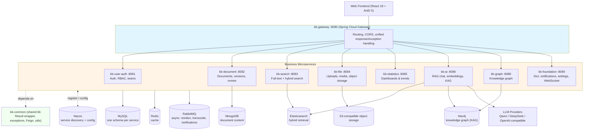

# Enterprise RAG Stack

A production-shaped, full-stack **Enterprise Knowledge Base + Retrieval-Augmented Generation** platform — Spring Cloud microservices on the backend, React on the frontend, and a hybrid retrieval / graph-RAG pipeline (vector + full-text + knowledge graph) in between.

> This is a learning/reference-grade project distilled from a real internal system. It is not battle-tested for production traffic — see [Security & Hardening Before Production](#security--hardening-before-production) before deploying it anywhere public.

## Why this project

Most open-source RAG demos are a single script bolted onto a vector store. This project is the opposite end of the spectrum: a **multi-service, multi-datastore system** showing how RAG fits into a real enterprise knowledge-base product — auth, document lifecycle, search, statistics, and an AI layer that combines vector search, full-text search, and a knowledge graph, all behind an API gateway with service discovery.

It's a useful reference if you want to see:
- How to structure a Spring Cloud microservice system around a RAG/AI core (`kb-ai`, `kb-graph`, `kb-search`) instead of a monolith.
- How **hybrid retrieval** (Elasticsearch full-text + vector similarity) and **graph-augmented generation (KAG)** (Neo4j entity/relation graph) can complement plain vector RAG.
- How to swap LLM providers (Qwen, DeepSeek, any OpenAI-compatible endpoint) at runtime via [LangChain4j](https://github.com/langchain4j/langchain4j).
- A full document-management product wrapped around that AI core: versioning, review workflows, sharing, permissions, tagging.

## Features

**Document Management**
- Rich document CRUD with a live-preview Markdown editor
- Categories, tags, comments, favorites, sharing, access control
- Version history and a review/approval workflow
- Import from PDF / Word / Excel / PPT / TXT / Markdown, and export

**Search**
- Full-text search and semantic (vector) search
- Hybrid retrieval combining both, with search suggestions and history

**AI Assistant (RAG + KAG)**
- Streaming chat grounded in your document corpus, with citations
- Multi-model routing (Qwen, DeepSeek, or any OpenAI-compatible model) via LangChain4j
- Document chunking, embedding, and vector indexing pipeline
- Graph-augmented retrieval: LLM-based entity/relation extraction builds a Neo4j knowledge graph that the assistant can traverse alongside vector/full-text results
- AI writing assistant and a feedback loop for response quality

**Knowledge Graph**
- Force-directed graph visualization with node-type filtering, search, and drag/zoom interaction
- Graph built and kept in sync from document content via the extraction pipeline

**Admin & Platform**
- JWT auth, RBAC (users, roles, permissions), and team management
- Operation logs, notifications, system config/dictionaries
- Usage statistics and trend dashboards
- Unified gateway response/exception handling across all services

## Architecture



## Tech Stack

| Layer | Technology |
|---|---|
| Backend framework | Spring Boot 3.2, Spring Cloud 2023.0, Spring Cloud Alibaba 2023.0.1 |
| Language / runtime | Java 21, Node.js (frontend) |
| Service discovery & config | Nacos |
| API gateway | Spring Cloud Gateway |
| ORM | MyBatis-Plus 3.5.8 + Druid |
| Relational data | MySQL 8.0 (one schema per service) |
| Document store | MongoDB |
| Cache | Redis 7.2 |
| Messaging | RabbitMQ (async reindexing, transcoding, notifications) |
| Full-text / vector search | Elasticsearch |
| Knowledge graph | Neo4j (Spring Data Neo4j) |
| RAG / LLM orchestration | LangChain4j, OpenAI-compatible chat models (Qwen, DeepSeek, etc.) |
| Object storage | S3-compatible (RustFS or any S3-compatible endpoint) |
| API docs | Knife4j (OpenAPI 3) |
| Frontend | React 18, TypeScript 5, Vite 5, Ant Design 5, Zustand, React Router 6, Axios, ECharts / AntD Charts |

## Repository Structure

```
Enterprise-RAG-Stack/
├── knowledge-base-backend-master/   # Spring Cloud microservices (Maven multi-module)
│   ├── kb-common/                   # Shared library: Result wrapper, exceptions, Feign, utils
│   ├── kb-gateway/                  # API gateway (:8080)
│   ├── kb-user-auth/                # Auth, RBAC, teams (:8081)
│   ├── kb-document/                 # Document lifecycle, versions, review (:8082)
│   ├── kb-search/                   # Full-text & hybrid search (:8083)
│   ├── kb-file/                     # Uploads, media transcoding, object storage (:8084)
│   ├── kb-statistics/               # Usage dashboards (:8085)
│   ├── kb-ai/                       # RAG chat, embeddings, KAG graph-RAG (:8086)
│   ├── kb-graph/                    # Knowledge graph service (:8088)
│   ├── kb-foundation/               # Dict, notifications, settings, WebSocket (:8089)
│   └── sql/                         # Per-service schema + seed scripts, init_all.sh
└── knowledge-base-frontend-master/  # React 18 + TypeScript + Vite + Ant Design SPA
```

## Getting Started

### Prerequisites

Install the following before running the stack:

- JDK 21+, Maven 3.8+, Node.js 18+
- MySQL 8.0+, Redis 7.2+, MongoDB, RabbitMQ, Elasticsearch, Neo4j
- [Nacos](https://nacos.io/) server (service discovery + config center)
- An S3-compatible object store for file uploads (e.g. RustFS, MinIO)
- An API key for at least one LLM provider (Qwen / DeepSeek / any OpenAI-compatible endpoint) to use the AI features

> No `docker-compose.yml` is included yet for this infrastructure — see [Roadmap](#roadmap). PRs adding one are very welcome.

### 1. Initialize the databases

```bash
cd knowledge-base-backend-master/sql
./init_all.sh   # creates all per-service MySQL schemas and seed data
```

Default admin account after seeding: `admin` / `123456` — **change this immediately**, see [Security](#security--hardening-before-production).

### 2. Configure services

Each module's `src/main/resources/application.yml` reads its connection settings from environment variables (with local defaults), e.g.:

```bash
export MYSQL_PASSWORD=your_password
export REDIS_HOST=localhost
export NACOS_SERVER_ADDR=127.0.0.1:8848
export RABBITMQ_HOST=localhost
export ELASTICSEARCH_URIS=http://localhost:9200
export NEO4J_URI=bolt://localhost:7687
export MONGODB_HOST=localhost
export QWEN_API_KEY=your_qwen_key       # or DEEPSEEK_API_KEY, etc.
```

### 3. Build and run the backend

```bash
cd knowledge-base-backend-master
mvn clean package -DskipTests

# start in order
java -jar kb-gateway/target/kb-gateway-1.0.0-SNAPSHOT.jar
java -jar kb-user-auth/target/kb-user-auth-1.0.0-SNAPSHOT.jar
java -jar kb-document/target/kb-document-1.0.0-SNAPSHOT.jar
java -jar kb-search/target/kb-search-1.0.0-SNAPSHOT.jar
java -jar kb-file/target/kb-file-1.0.0-SNAPSHOT.jar
java -jar kb-statistics/target/kb-statistics-1.0.0-SNAPSHOT.jar
java -jar kb-ai/target/kb-ai-1.0.0-SNAPSHOT.jar
java -jar kb-graph/target/kb-graph-1.0.0-SNAPSHOT.jar
java -jar kb-foundation/target/kb-foundation-1.0.0-SNAPSHOT.jar
```

Each module can also be run directly from your IDE via its `*Application.java` main class.

### 4. Run the frontend

```bash
cd knowledge-base-frontend-master
npm install
npm run dev
```

Visit `http://localhost:5173`.

### API documentation

Each service exposes Knife4j (OpenAPI 3) docs, e.g.:
- Auth service: `http://localhost:8081/api/auth/doc.html`
- Document service: `http://localhost:8082/api/document/doc.html`
- (same pattern for the other services, on their respective ports above)

## Security & Hardening Before Production

This codebase prioritizes showing the architecture end-to-end, not production hardening. Before exposing it beyond local/dev use:

- **Change the default admin password** (`admin` / `123456`) immediately after seeding.
- **Rotate all default credentials** in the SQL seed scripts and `application.yml` defaults (MySQL, Redis, RabbitMQ, Nacos, Neo4j all ship with example passwords for local dev).
- Set real secrets (JWT signing key, LLM API keys, datastore passwords) via environment variables or a secrets manager — never commit them.
- Review CORS (`allowedOriginPatterns: "*"` in the gateway config) and lock it down to known origins.
- Put the whole stack behind TLS; none of the services terminate TLS themselves in this repo.

## Roadmap

- [ ] `docker-compose.yml` for one-command infra bring-up (MySQL, Redis, RabbitMQ, Nacos, Elasticsearch, Neo4j, MongoDB)
- [ ] CI (build + test) via GitHub Actions
- [ ] Automated tests for the retrieval and graph-extraction pipelines

## Contributing

Issues and PRs are welcome — this is meant to be a useful reference architecture, so contributions that improve clarity, add tests, or hardening are especially appreciated.

## License

Licensed under the [MIT License](LICENSE).
