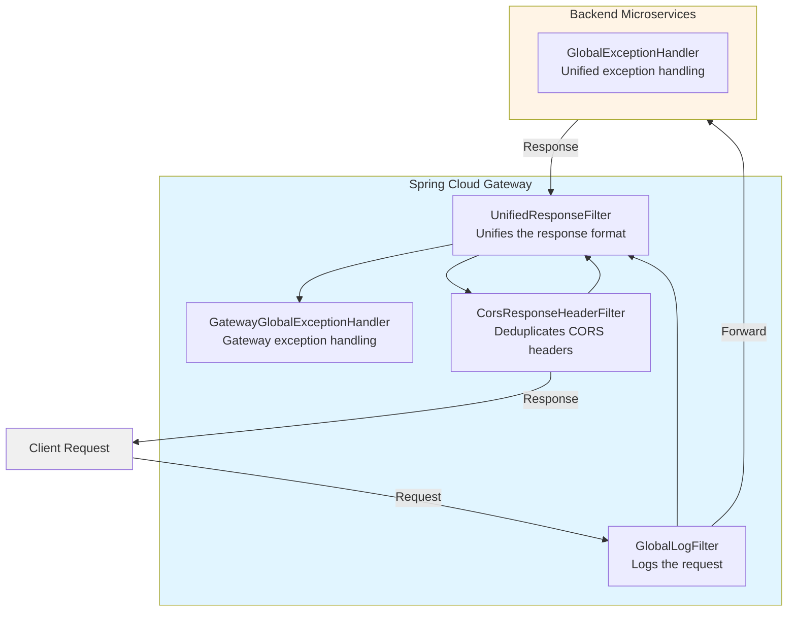
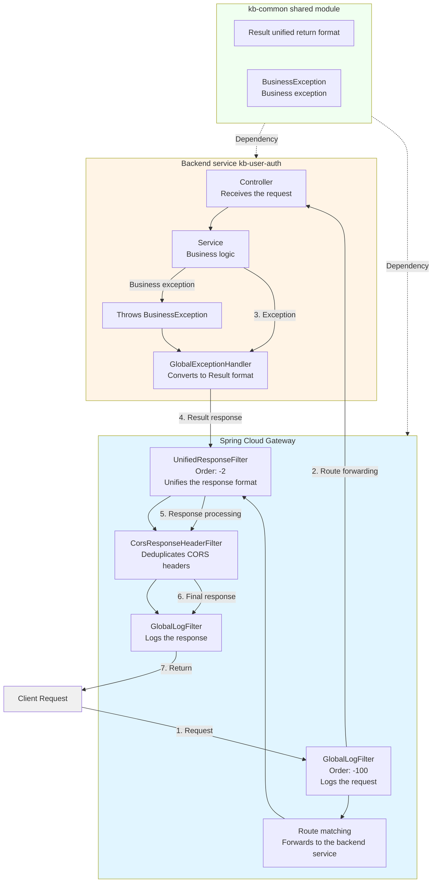
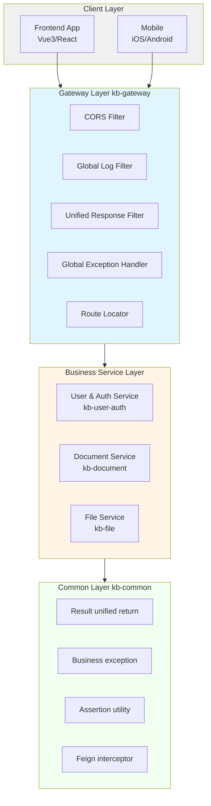
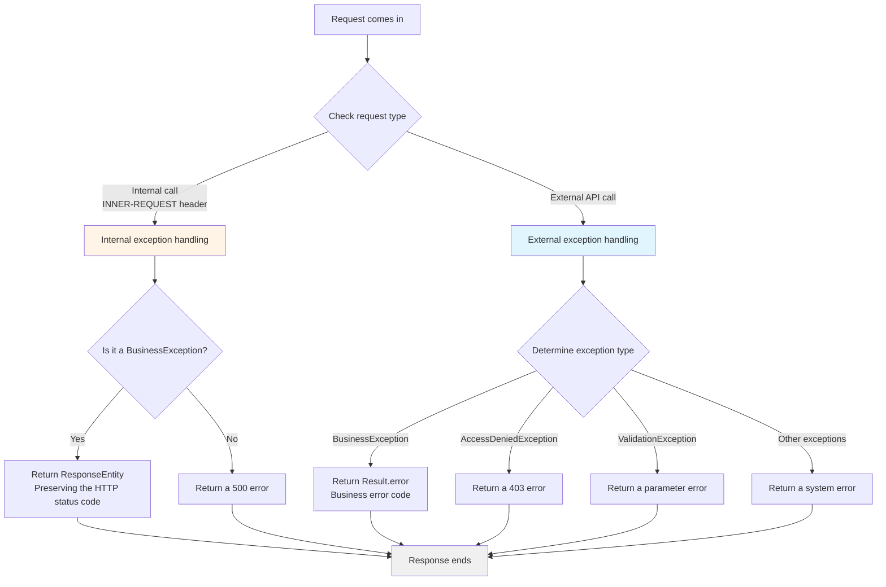
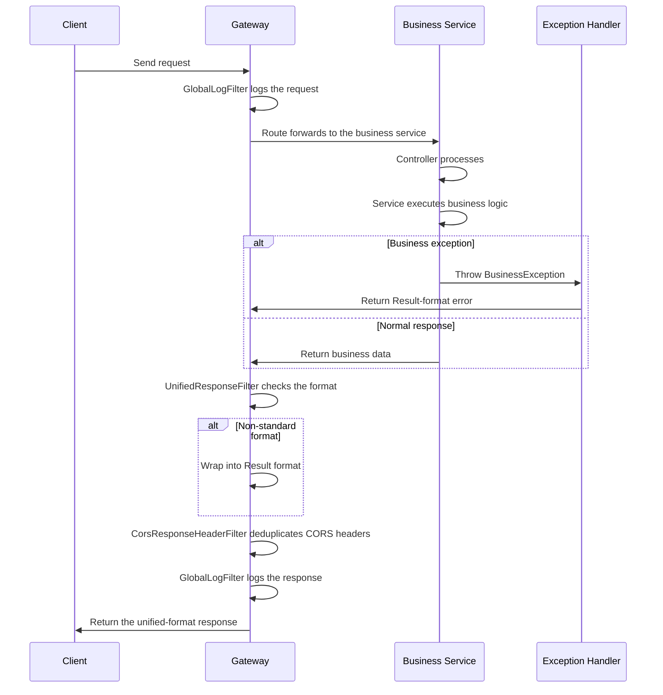

# Adding Unified Wrapping of Gateway Response Values and Exceptions - Architecture Diagrams

This document contains the Mermaid syntax for all architecture diagrams in the article, which can be imported into draw.io.

## 1. Technical Architecture Diagram (API Call Flow)



## 2. Full Call Chain Diagram



## 3. System Layered Architecture Diagram



## 4. Exception Handling Flow Diagram



## 5. Response Handling Flow Diagram



## Using These Diagrams in draw.io

### Method 1: Use the Mermaid Plugin
1. Open draw.io
2. Select `Arrange` → `Insert` → `Advanced` → `Mermaid`
3. Paste the Mermaid code above into the dialog
4. Click Insert

### Method 2: Online Conversion
1. Visit https://mermaid.live/
2. Paste the code into the editor
3. Export as SVG/PNG
4. Import the image into draw.io

### Method 3: Command-Line Generation
```bash
# Install mermaid-cli
npm install -g @mermaid-js/mermaid-cli

# Generate the image
mmdc -i diagrams.md -o architecture.png
```

## Diagram Descriptions

- **Technical Architecture Diagram**: shows the overall flow and tech stack of an API call
- **Full Call Chain Diagram**: shows the complete chain from client to response in detail
- **System Layered Architecture Diagram**: shows the system's layered structure and the relationships between layers
- **Exception Handling Flow Diagram**: shows the handling flow for different types of exceptions
- **Response Handling Flow Diagram**: shows the complete request-response process as a sequence diagram
